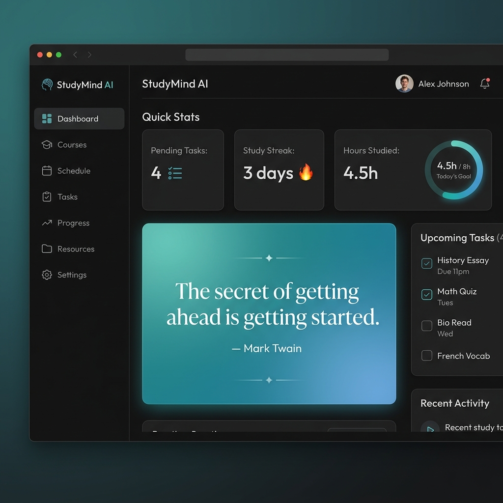
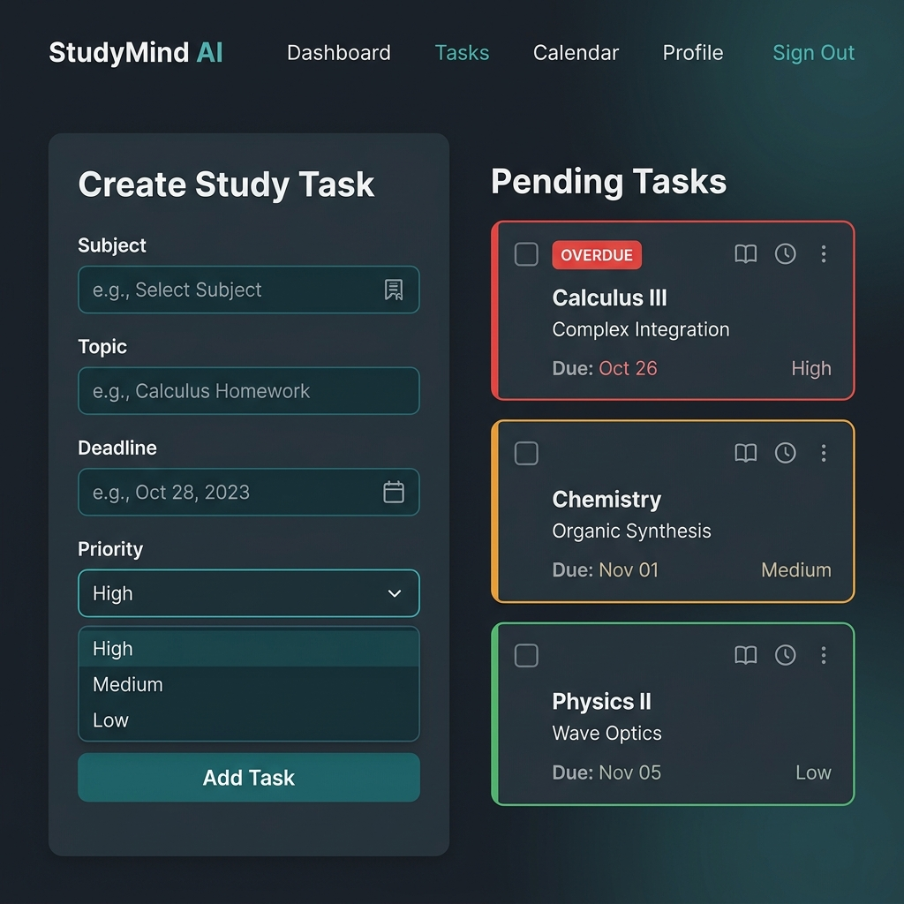
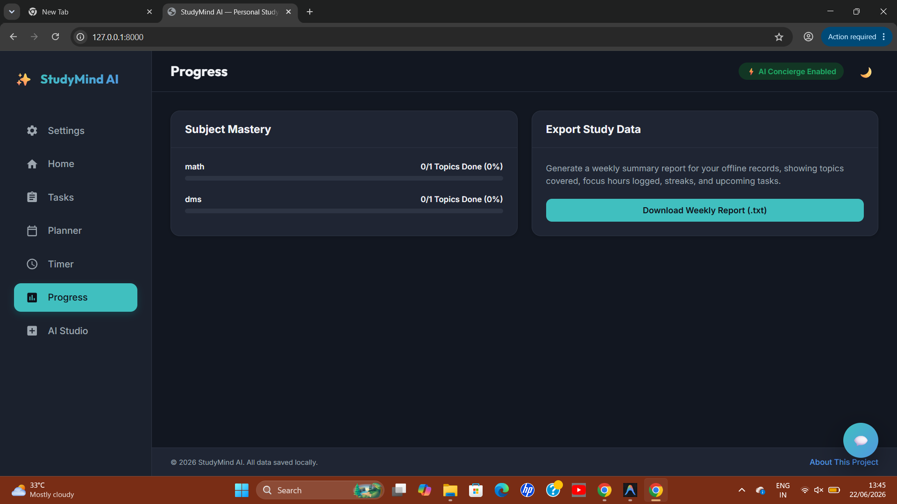
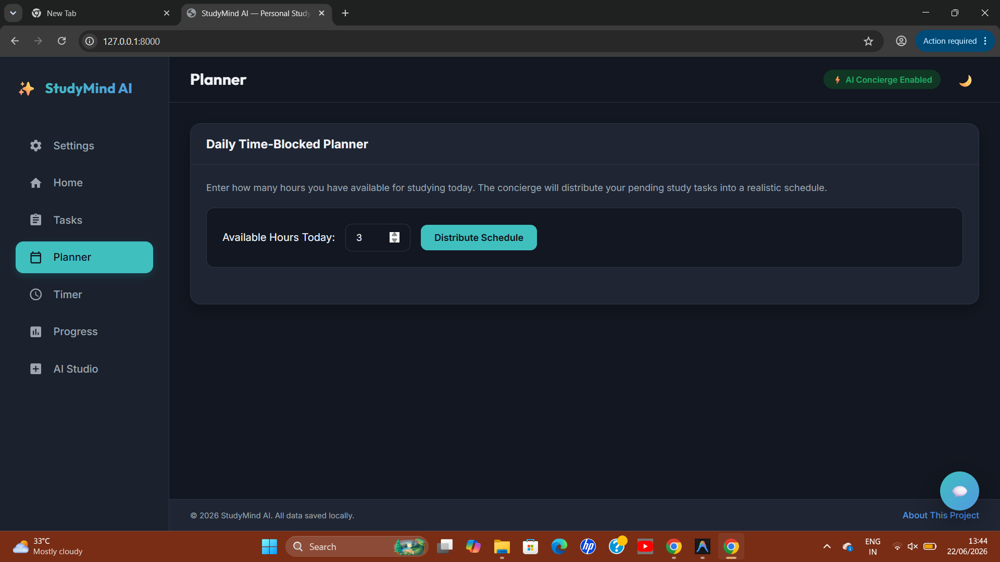

# StudyMind AI — Personal Study Concierge




## 📌 Overview
StudyMind AI is an offline-first, premium client-side personal AI study concierge designed to help students optimize their schedules, block study hours, focus with Pomodoros, check in on energy levels, and learn dynamically.

* **Built for:** Kaggle x Google AI Agents Capstone 2026 — Concierge Agents Track
* **Live Demo Link:** [https://ishudubey.github.io/studymind-ai/](https://ishudubey.github.io/studymind-ai/)

---

## 📸 Screenshots

Here is a visual walk-through of the interface. We will capture and upload these screenshots directly into the `/screenshots` directory:

### Dashboard (Home)


### Task Manager


### Progress Dashboard


### AI Chat Concierge


### Daily Planner Timeline


---

## 🌟 Features

- 📅 **Task Manager:** Create tasks with subject, topic, deadline date, and priority selector. Auto-sorts overdue tasks first, then by deadline, then by priority level (High > Medium > Low). Includes color-coded urgency states (red = overdue, amber = due in ≤ 3 days, green = safe).
- 🕒 **Daily Planner:** Provide available hours for today, and the app auto-distributes pending tasks into 45-minute focus intervals and 15-minute breaks on a clean chronological timeline.
- ⏱️ **Pomodoro Timer:** Work in 25-minute focus / 5-minute break cycles with synthetic sound alerts. Tracks total sessions completed per subject.
- 📊 **Progress Dashboard:** Shows progress completion meters per subject, total hours studied this week, consecutive day streaks, and motivational quotes.
- 💬 **AI Chat Concierge:** A floating chat interface utilizing a system prompt to deliver short, encouraging study and scheduling advice, incorporating the student's task lists and energy level mood logs.
- 💡 **Topic Explainer:** One-click simple 5-bullet explanations on task cards to assist students when they are stuck.
- 📝 **Quiz Generator:** Submits textbook notes to Gemini to automatically compile a 5-question interactive MCQ quiz with live in-app scoring.
- 📚 **Syllabus Planner:** Parses raw syllabus outlines to automatically break chapters down into subjects and tasks with recommended priorities.
- 📥 **Weekly Report Export:** Instantly compile study logs, hours, focus sessions, mood logs, and pending tasks into a downloadable `.txt` report.
- 🌓 **Dark / Light Mode:** Easily toggle UI themes on the fly.
- 🔌 **Fully Offline-Capable:** Operates entirely client-side with no logins, database setups, or complex servers required.
- 🔒 **Data Privacy:** Stores all configuration keys and task logs in your browser's local `localStorage`.

---

## 🔑 How to Get Your Free API Key

StudyMind AI calls the Gemini API directly from your browser. To set up your credentials:
1. Go to [Google AI Studio](https://aistudio.google.com).
2. Sign in with your Google account.
3. Click on the **"Create API Key"** button.
4. Click **"Create API Key in new project"** (or choose an existing project).
5. Copy your generated key string.
6. Open StudyMind AI, navigate to the **Settings** view (or Onboarding panel), paste the key, and click **"Save API Key"**.

> [!NOTE]
> The Gemini API Key is **100% Free** to get and test. It requires no credit cards and includes a high rate limit of **1500 requests/day** under the free tier.

---

## 💻 Tech Stack

- **Core Structure:** HTML5, CSS3 (Vanilla design properties supporting light/dark theme systems)
- **Application Engine:** Vanilla JavaScript (ES6 modules and event engines)
- **AI Model:** Gemini 2.5 Flash Lite API (via raw fetch POST requests to v1beta)
- **State & Database:** `localStorage` for private client-side persistence
- **Hosting:** GitHub Pages (zero-cost static hosting)

---

## 🛡️ Privacy & Security

- No user statistics, login information, or task records leave your local device.
- The Gemini API Key is stored locally in your browser's private state (`localStorage`) and is only sent to Google's official API endpoints.
- There are no databases, backend nodes, tracking analytics, or trackers involved.

---

## 📂 Project Structure

```
studymind-ai/
│
├── index.html        # App layout, modal windows, navigation shells, and SVG icons
├── styles.css        # Premium stylesheets, responsive HSL layout systems, and theme variables
├── app.js            # Main controller governing navigation, Pomodoro timers, and LocalStorage
├── gemini.js         # API integration layer for prompt constructs and error handling
├── .gitignore        # Tells git which files to ignore (.env, node_modules, DS_Store)
├── README.md         # Full project documentation, badges, and guidelines
└── screenshots/      # Folder containing UI screenshot resources for evaluation
```

---

## 📄 License

This project is licensed under the MIT License - see below for details.

```
MIT License

Copyright (c) 2026

Permission is hereby granted, free of charge, to any person obtaining a copy
of this software and associated documentation files (the "Software"), to deal
in the Software without restriction, including without limitation the rights
to use, copy, modify, merge, publish, distribute, sublicense, and/or sell
copies of the Software, and to permit persons to whom the Software is
furnished to do so, subject to the following conditions:

The above copyright notice and this permission notice shall be included in all
copies or substantial portions of the Software.

THE SOFTWARE IS PROVIDED "AS IS", WITHOUT WARRANTY OF ANY KIND, EXPRESS OR
IMPLIED, INCLUDING BUT NOT LIMITED TO THE WARRANTIES OF MERCHANTABILITY,
FITNESS FOR A PARTICULAR PURPOSE AND NONINFRINGEMENT. IN NO EVENT SHALL THE
AUTHORS OR COPYRIGHT HOLDERS BE LIABLE FOR ANY CLAIM, DAMAGES OR OTHER
LIABILITY, WHETHER IN AN ACTION OF CONTRACT, TORT OR OTHERWISE, ARISING FROM,
OUT OF OR IN CONNECTION WITH THE SOFTWARE OR THE USE OR OTHER DEALINGS IN THE
SOFTWARE.
```
